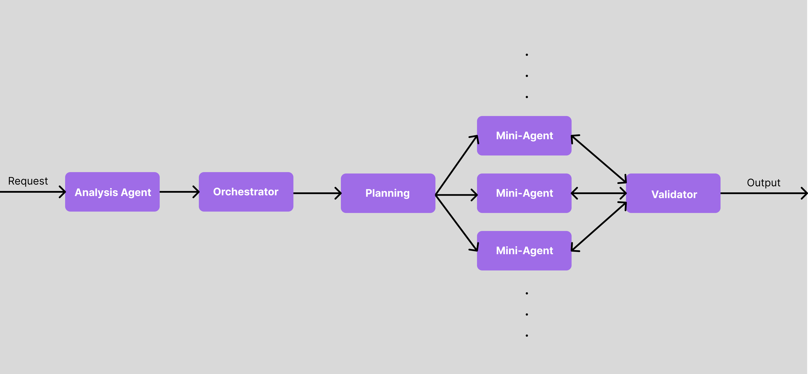

# VisionZ➕


First of its kind data visualization and analysis platform powered by our groundbreaking Multi-Agent AI Architecture. Analyze **any** dataset with just a drag and drop.

Stanford TreeHacks 2025

## Revolutionary Multi-Agent AI Architecture

VisionZ+ employs a sophisticated Multi-Agent AI system that processes your requests through a highly orchestrated pipeline:



1. **Analysis Agent** 🔍
   - First point of contact for all user requests
   - Performs initial request analysis and requirement extraction
   - Translates natural language into structured task specifications

2. **Orchestrator Agent** 🎮
   - Central command center of the system
   - Coordinates complex workflows between agents
   - Manages resource allocation and task prioritization

3. **Planning Engine** 📋
   - Breaks down complex tasks into smaller, manageable sub-tasks
   - Develops execution strategies for optimal results
   - Creates dynamic task graphs for parallel processing

4. **Mini-Agents Swarm** 🐝
   - Specialized micro-agents working in parallel
   - Each agent focuses on a specific sub-task:
     - Data Processing Agents
     - Visualization Agents
     - Pattern Recognition Agents
     - Statistical Analysis Agents
   - Dynamic scaling based on task complexity

5. **Validator Agent** ✅
   - Quality assurance and result verification
   - Ensures consistency and accuracy of outputs
   - Performs cross-validation of results
   - Optimizes final output for user consumption

This advanced pipeline delivers:
- Highly accurate and validated results
- Parallel processing for faster insights
- Scalable architecture for complex tasks
- Robust error handling and quality control
- Real-time adaptive processing

## Setup Instructions

### Backend Setup

1. Navigate to the backend directory:
   ```bash
   cd backend
   ```

2. Install dependencies:
   ```bash
   npm install
   ```

3. Set up environment variables:
   - Edit `.env` and add your OpenAI API key:
     ```
      PORT = Server port (default: 5000)
      MONGODB_URI = MongoDB connection string
      OPENAI_API_KEY = Your OpenAI API key (required)
      NODE_ENV = Node environment (development/production)     
   ```
   - Update other environment variables as needed

4. Start the backend server:
   ```bash
   npm start
   ```

### Frontend Setup

1. Navigate to the frontend directory:
   ```bash
   cd frontend
   ```

2. Install dependencies:
   ```bash
   npm install
   ```

3. Start the development server:
   ```bash
   npm run dev
   ```

## Environment Variables

### Backend (.env)

- `PORT`: Server port (default: 5000)
- `MONGODB_URI`: MongoDB connection string
- `OPENAI_API_KEY`: Your OpenAI API key (required)
- `NODE_ENV`: Node environment (development/production)

## API Endpoints

### AI Generation

- `POST /api/ai/generate`
  - Generates AI-powered visualizations and analysis
  - Requires valid OpenAI API key
  - Request body:
    ```json
    {
      "prompt": "Your analysis prompt here"
    }
    ```

## Error Handling

The API includes comprehensive error handling for:
- Missing or invalid OpenAI API key
- API quota exceeded
- Invalid requests
- Server errors
