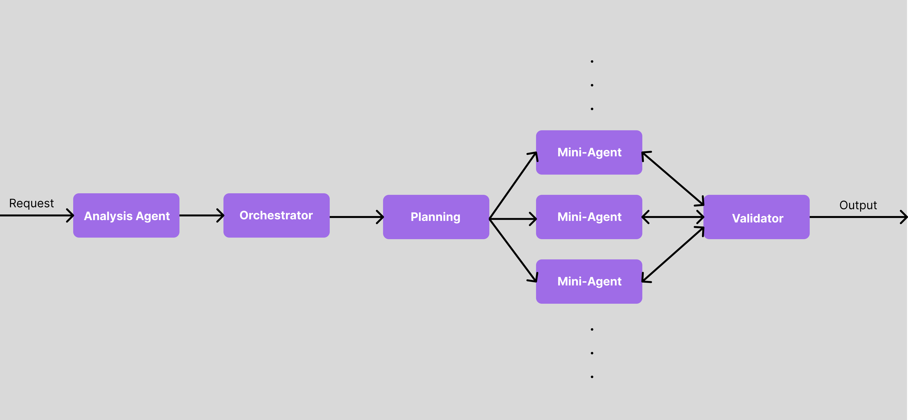

# VisionZ➕

VisionZ+, Your data scientist.


First of its kind data visualization and analysis platform powered by our groundbreaking Multi-Agent AI Architecture. Analyze **any** dataset with just a drag and drop.

Stanford TreeHacks 2025.

### Team:
<a href="https://youweizhen.com" target="_blank">Youwei Zhen</a> (Brown University), 
<a href="http://linkedin.com/in/taorui-huang/" target="_blank">Taorui Huang</a> (Stanford University), 
<a href="https://www.linkedin.com/in/a-zimina/" target="_blank">Anni Zimina</a> (Stanford University)
<a href="http://linkedin.com/in/nickadesina" target="_blank">Nick Adesina</a> (UC Berkeley), 

<p float="left">
   
   
</p>

## What is VisionZ+
VisionZ+ is a first-of-its-kind data visualization and analysis platform that lets users analyze any dataset through a simple drag-and-drop interface. With our dataset assistant, you can simply ask questions about your data and let the AI find patterns and insights for you. The platform is powered by a Multi-Agent AI Architecture that processes data through multiple specialized agents - from initial analysis and orchestration to planning, execution via mini-agent swarms, and validation. This makes sophisticated data analysis accessible to anyone, regardless of their technical background. Whether you're a medical researcher analyzing patient data, a military strategist evaluating operations, a financial advisor tracking markets, or a small business owner understanding operations, VisionZ+ eliminates the need for a dedicated data science team - just ask questions and get insights.

## Revolutionary Multi-Agent AI Architecture

VisionZ+ employs a sophisticated Multi-Agent AI system that processes your requests through a highly orchestrated pipeline:



1. **Analysis Agent** 🔍
   - First point of contact for all user requests
   - Performs initial request analysis and requirement extraction
   - Translates natural language into structured task specifications

2. **Orchestrator Agent** 🎮
   - Central command center of the system
   - Coordinates complex workflows between agents
   - Manages resource allocation and task prioritization

3. **Planning Engine** 📋
   - Breaks down complex tasks into smaller, manageable sub-tasks
   - Develops execution strategies for optimal results
   - Creates dynamic task graphs for parallel processing

4. **Mini-Agents Swarm** 🐝
   - Specialized micro-agents working in parallel
   - Each agent focuses on a specific sub-task:
     - Data Processing Agents
     - Visualization Agents
     - Pattern Recognition Agents
     - Statistical Analysis Agents
   - Dynamic scaling based on task complexity

5. **Validator Agent** ✅
   - Quality assurance and result verification
   - Ensures consistency and accuracy of outputs
   - Performs cross-validation of results
   - Optimizes final output for user consumption

This advanced pipeline delivers:
- Highly accurate and validated results
- Parallel processing for faster insights
- Scalable architecture for complex tasks
- Robust error handling and quality control
- Real-time adaptive processing

## Inspiration

We believe everyone deserves their own personal data scientist. In today's data-driven world, the ability to extract meaningful insights from data shouldn't be limited to those with technical expertise or resources to hire analysts. Whether you're a medical researcher analyzing patient outcomes, a military strategist evaluating field operations, or a financial advisor tracking market trends, understanding your data is crucial for making informed decisions.

This vision drove us to create VisionZ+. In healthcare, it can help doctors identify patterns in patient vitals and treatment responses. Military personnel can use it to analyze sensor data from equipment and personnel, enhancing operational efficiency and safety. Financial institutions can leverage it to detect market patterns and assess risk factors. Even small business owners can gain valuable insights about their operations without needing a dedicated data science team.

By combining cutting-edge AI with an intuitive interface, we're making sophisticated data analysis accessible to everyone, regardless of their technical background or industry.

## Setup Instructions

### Backend Setup

1. Navigate to the backend directory:
   ```bash
   cd backend
   ```

2. Install dependencies:
   ```bash
   npm install
   ```

3. Set up environment variables:
   - Edit `.env` and add your OpenAI API key:
     ```
      PORT = Server port (default: 5000)
      MONGODB_URI = MongoDB connection string
      OPENAI_API_KEY = Your OpenAI API key (required)
      NODE_ENV = Node environment (development/production)     
   ```
   - Update other environment variables as needed
4. Start the backend server:
   ```bash
   npm start
   ```

### Frontend Setup

1. Navigate to the frontend directory:
   ```bash
   cd frontend
   ```

2. Install dependencies:
   ```bash
   npm install
   ```

3. Start the development server:
   ```bash
   npm run dev
   ```

## Environment Variables

### Backend (.env)

- `PORT`: Server port (default: 5000)
- `MONGODB_URI`: MongoDB connection string
- `OPENAI_API_KEY`: Your OpenAI API key (required)
- `NODE_ENV`: Node environment (development/production)

## API Endpoints

### AI Generation

- `POST /api/ai/generate`
  - Generates AI-powered visualizations and analysis
  - Requires valid OpenAI API key
  - Request body:
    ```json
    {
      "prompt": "Your analysis prompt here"
    }
    ```

## Error Handling

The API includes comprehensive error handling for:
- Missing or invalid OpenAI API key
- API quota exceeded
- Invalid requests
- Server errors
